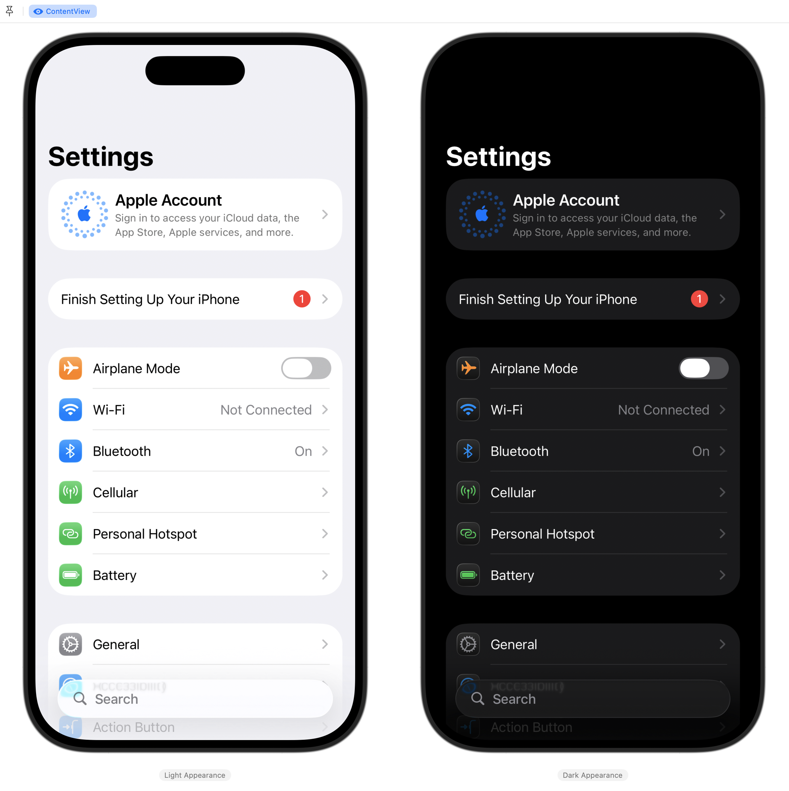
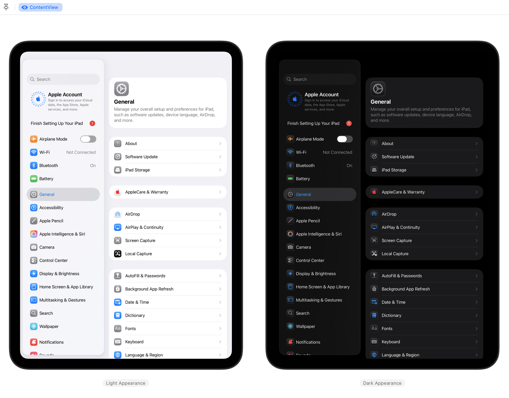

# Settings-iOS
A **work-in-progress** recreation of the iOS & iPadOS Settings app (Preferences.app).

> [!NOTE]  
> This project is focused on the latest public releases of iOS, iPadOS, and Xcode. Use an older branch for older versions.

## Information
- Based on iOS & iPadOS 26.2 (23C55).
- All features within the app are only simulations and have no effect on the device outside of the app.
- Features available within the app vary depending on the device model and its capabilities to maximize accuracy.
- In some panes, actual preference bundles will be loaded internally using a view controller bridge (functionality and stability may vary).
- Previous versions are available as their own branches, going as far back as 17.4. Fewer features are available in earlier versions.

> [!CAUTION]
> Some of the code in this project may rely on private APIs. It is strictly for demonstration purposes only.
>
> 

>  
List

>  - AuthKitUI 
>  - CameraUI 
>  - HelpKit 
>  - MobileGestalt 
>  - OnBoardingKit 
>  - Preferences 
>  - SpringBoardServices 
> 

>
> **Do not reuse any code from this project that relies on private methods.** Consider publicly supported alternatives instead.

## Preview

iOS 26

  
  <picture>
    <source media="(prefers-color-scheme: dark)" srcset="Assets/iOS26Dark.png">
    
  </picture>

iPadOS 26

  
  <picture>
    <source media="(prefers-color-scheme: dark)" srcset="Assets/iPadOS26Dark.png">
    
  </picture>

## Usage
Open in Xcode and run with either Simulator or a physical device running iOS or iPadOS with Developer Mode enabled as a destination.

> [!IMPORTANT]  
> You may need to change the bundle identifier of the app to be able to sign it with Xcode for use on a physical device.

To switch between Simulator and physical-like layout of Settings, modify the `forcePhysical` variable on line 13 of `PrimarySettingsListModel.swift` under `Preferences/Models`.

## Disclaimers
- This app is a personal and educational recreation of Apple's apps and designs, made in appreciation of the teams that built and maintain them.
- All assets including icons, images, localization strings, and other resources are not my own in any way.
- If you have any questions or feedback, please contact me through the options listed on my profile.

## Other Settings Projects
- **macOS System Settings** https://github.com/zhrispineda/System-Settings
- **visionOS Settings** https://github.com/zhrispineda/Settings-visionOS
- **watchOS Settings** https://github.com/zhrispineda/Settings-watchOS
- **tvOS Settings** https://github.com/zhrispineda/Settings-tvOS
