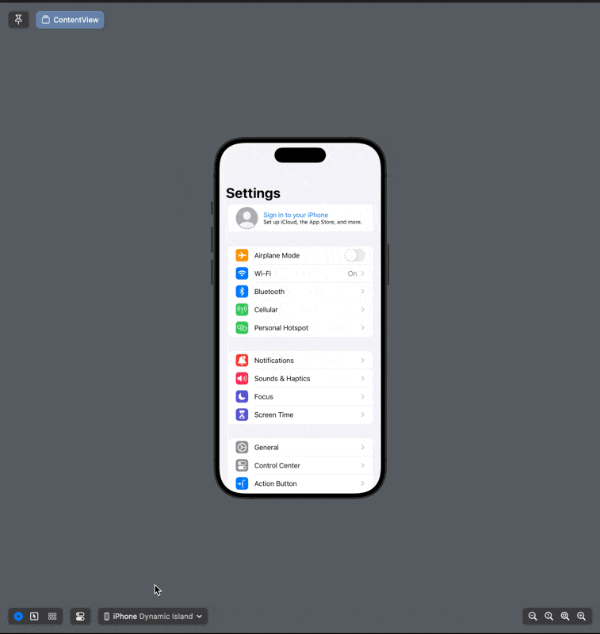

#  Settings-iOS
SwiftUI **(work-in-progress)** recreation of the iOS & iPadOS Settings app.

## Examples

## Information
- This personal project is a recreation of Apple's current and default Settings app for iPhone and iPad on **Simulator and iOS/iPadOS** running 17.5 (21F79).
- All features within the app are only simulations and have no effect on the device outside of the app.
- Most views are complete, but lack features such as saving keys/data, for now.
- Aspects such as simulated controls and views for wireless settings, are incomplete for now.
- This project does not make use of Swift Packages, UIKit, Storyboards, or Objective-C; it is purely Swift & SwiftUI.

## Usage
Open the project in Xcode and run with either a Simulator instance running iOS/iPadOS or a physical iPhone/iPad with Developer Mode enabled as a destination.
To switch between the simulator or physical-like view of Settings, modify the `isSimulator` variable on line 12 of `SettingsModel.swift` under Preferences/Models.

As this is a personal project for learning Swift and SwiftUI, feel free to download and modify the project for your own personal purposes.

## To Do
- Basic data saving and loading.
- Complete incomplete views.
- Implement simulated functionality of different features.

## Disclaimers
- All assets such as icons and images are not my own in any way.
- This app is a recreation of Apple's own apps and its designs for learning purposes.
- Feel free to look through the commit history to see the project evolve from a single view to its current state.
