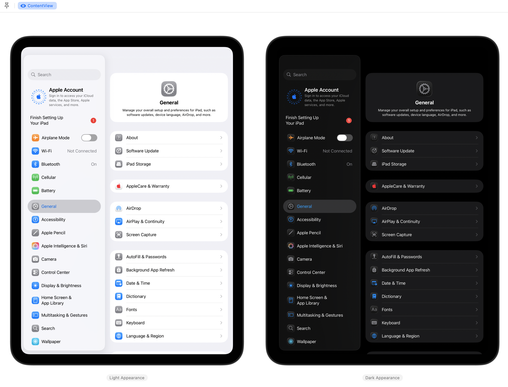

# Settings-iOS
A **work-in-progress** SwiftUI recreation of the iOS & iPadOS Settings app (Preferences.app).

> [!IMPORTANT]  
> This project is focused on iOS & iPadOS 26 using Xcode 26. Use an older branch to deploy this project on iOS & iPadOS 18/Xcode 16 or earlier.

## Information
- This personal project is a recreation of Apple's Settings app for iOS and iPadOS 26.0.1 (23A355).
- All features within the app are only simulations and have no effect on the device outside of the app.
- Features available within the app vary depending on the device model and its capabilities to make this recreation as accurate as possible.
- In some panes, the app will load actual preference bundles internally using a view controller bridge (functionality and stability may vary).
- Previous versions are available as their own branches in this repository, going as far back as 17.4.

## Preview

iOS 26

  

iPadOS 26

  

## Usage
Open the project in Xcode and run with either a Simulator instance or a physical device running iOS or iPadOS with Developer Mode enabled as a destination.

> [!IMPORTANT]  
> You may need to change the bundle identifier of the app to be able to sign it with Xcode for use on a physical device.

To switch between the simulator and physical-like layout of Settings in Simulator or Preview, modify the `forcePhysical` variable on line 12 of `SettingsModel.swift` under `Preferences/Models`.

As this is a project for learning Swift and SwiftUI, feel free to download or fork and modify the project for your own personal use.

## Disclaimers
- All assets including icons and images are not my own in any way.
- This app is a recreation of Apple's own apps and designs for educational purposes only.
- Feel free to look through the commit history to see the project evolve from a single view to its current state.
- If you have any questions or feedback, please contact me through the options listed on my profile.

## Other Settings Projects
- **macOS System Settings** https://github.com/zhrispineda/System-Settings
- **visionOS Settings** https://github.com/zhrispineda/Settings-visionOS
- **watchOS Settings** https://github.com/zhrispineda/Settings-watchOS
- **tvOS Settings** https://github.com/zhrispineda/Settings-tvOS
